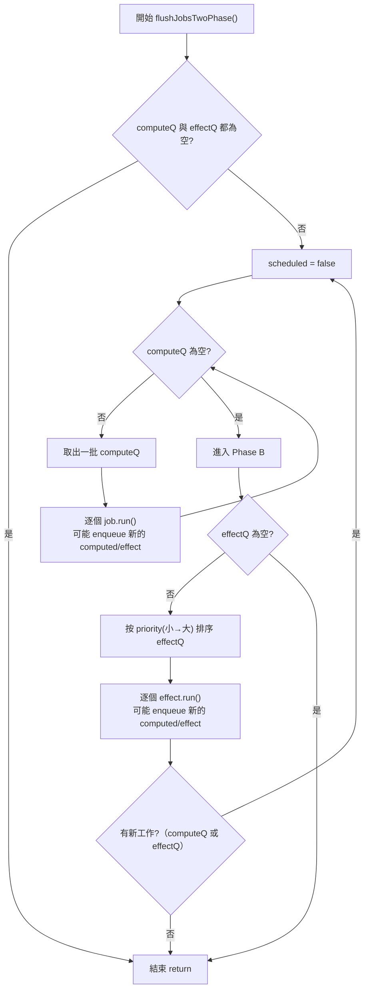
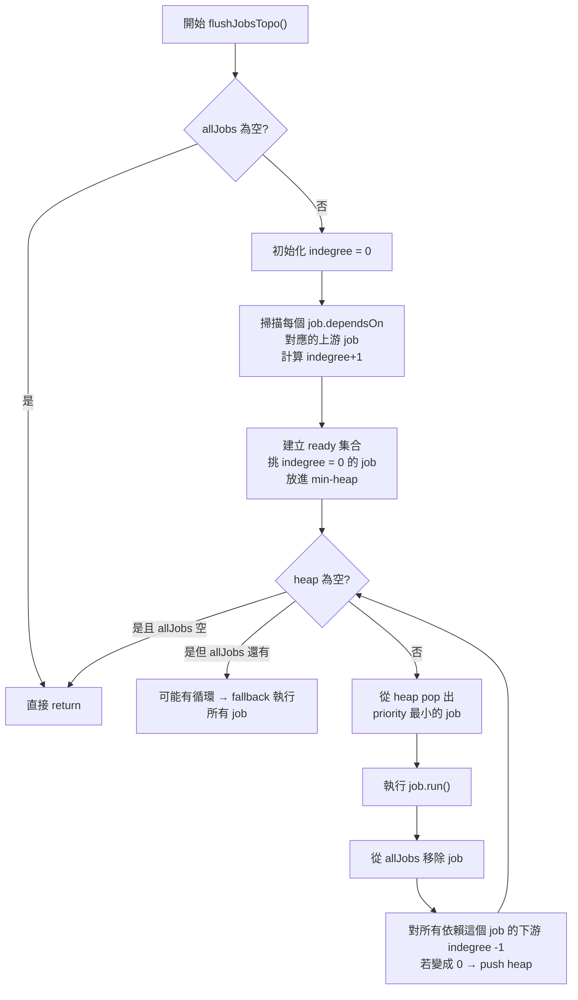

# reactivity_lessons

## 2025 IThome articles

- 專案內的 Lesson 代號會對應 signal 實作開始的環節
- 每個 Lesson 代號會對應上一章節的 code 往下延伸，方便讀者閱讀
- 核心的部分與鐵人賽文章內的設定是相同的，這系列以教學為主，所以要轉為 production 使用的話，要考慮資料結構與記憶體釋放的問題

### Two-phase flush flow chart

### Topological flow chart

