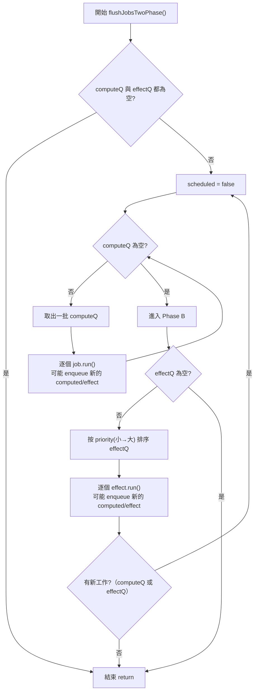
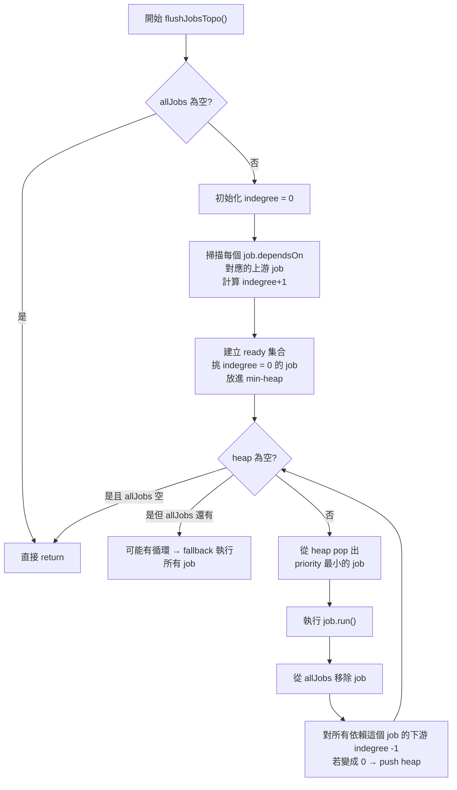

# reactivity_lessons

## 2025 IThome articles

- 專案內的 Lesson 代號會對應 signal 實作開始的環節
- 每個 Lesson 代號會對應上一章節的 code 往下延伸，方便讀者閱讀
- 核心的部分與鐵人賽文章內的設定是相同的，這系列以教學為主，所以要轉為 production 使用的話，要考慮資料結構與記憶體釋放的問題

## Lesson 1: signal basic

透過簡單的 "閉包 + 解構" 技巧，建構基本能夠暫存的單元

## Lesson 2: signal with subscribe

對應系列文章中，加上訂閱機制的應用

## Lesson 3: effect symbol

對應系列文章中，Effect 實作的初步講解

## Lesson 4: effect weakmap

對應系列文章中，Effect 選型的講解

## Lesson 5: computed

對應系列文章中，computed 實作章節

## Lesson 6: batch

對應系列文章中，batch & transaction 的講解

## Lesson 7: react case

對應系列文章中，React 應用的內容

## Lesson 8: vue case

對應系列文章中，vue 應用的內容

## Lesson 9: transaction async

對應系列文章中，進階內核探討的 async transaction 議題

## Lesson 10: atomic transaction

對應系列文章中，進階內核探討的原子交易

## Lesson 11: scheduler adv

對應系列文章中，進階內核探討的 scheduler 進階議題

## Lesson 12: devtools

對應系列文章中，進階內核實作的簡易 Devtools

## Lesson 13: two-phase flush

額外補充牽涉到 Scheduler 處裡排程會遇到的優先順序議題，這裡對應的解法就是 "批次 + 優先級" 的方式。

### Two-phase flush flow chart

## Lesson 14: Topological

額外補充內容，也可以考慮採用 "拓樸排序+優先級" 的方式來處理，這些比較進階，會牽涉到 Graph 算法的應用。

### Topological flow chart

