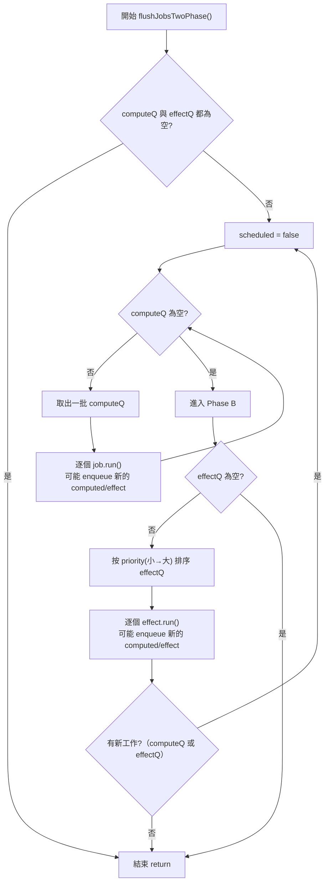
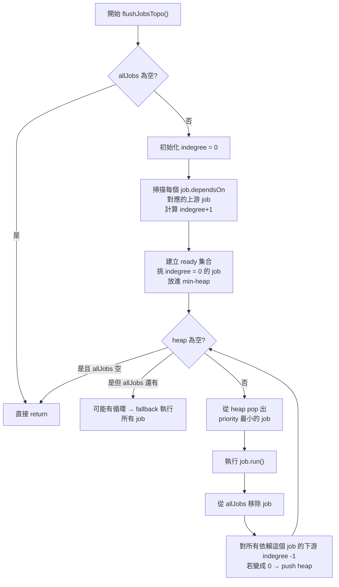
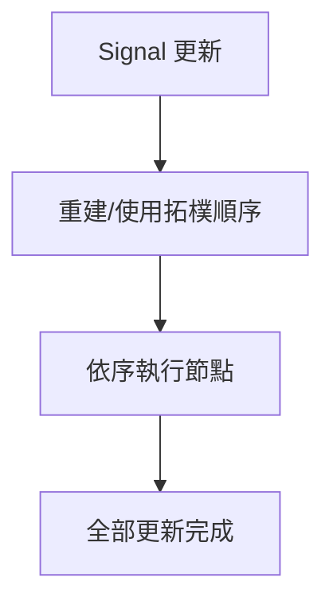
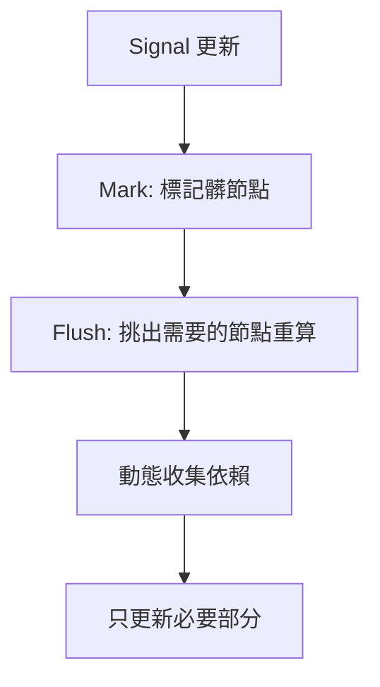

# reactivity_lessons

## 2025 IThome articles

- 專案內的 Lesson 代號會對應 signal 實作開始的環節
- 每個 Lesson 代號會對應上一章節的 code 往下延伸，方便讀者閱讀
- 核心的部分與鐵人賽文章內的設定是相同的，這系列以教學為主，所以要轉為 production 使用的話，要考慮資料結構與記憶體釋放的問題

## Lesson 1: signal basic

透過簡單的 "閉包 + 解構" 技巧，建構基本能夠暫存的單元  
👉 [文章連結](https://ithelp.ithome.com.tw/articles/10374051)

## Lesson 2: signal with subscribe

對應系列文章中，加上訂閱機制的應用  
👉 [文章連結](https://ithelp.ithome.com.tw/articles/10374070)

## Lesson 3: effect symbol

對應系列文章中，Effect 實作的初步講解  
👉 [文章連結](https://ithelp.ithome.com.tw/articles/10374158)

## Lesson 4: effect weakmap

對應系列文章中，Effect 選型的講解  
👉 [文章連結](https://ithelp.ithome.com.tw/articles/10374388)

## Lesson 5: computed

對應系列文章中，computed 實作章節  
👉 [文章連結](https://ithelp.ithome.com.tw/articles/10374474)

## Lesson 6: batch

對應系列文章中，batch & transaction 的講解  
👉 [文章連結](https://ithelp.ithome.com.tw/articles/10374497)

## Lesson 7: react case

對應系列文章中，React 應用的內容  
👉 [對應 React (I)](https://ithelp.ithome.com.tw/articles/10374805)  
👉 [對應 React (II)](https://ithelp.ithome.com.tw/articles/10374827)  
👉 [對應 React (III)](https://ithelp.ithome.com.tw/articles/10374977)  
👉 [對應 React (IV)](https://ithelp.ithome.com.tw/articles/10375129)  
👉 [對應 React (V)](https://ithelp.ithome.com.tw/articles/10375334)  
👉 [對應 React (VI)](https://ithelp.ithome.com.tw/articles/10375381)

## Lesson 8: vue case

對應系列文章中，vue 應用的內容  
👉 [對應 Vue (I)](https://ithelp.ithome.com.tw/articles/10375400)  
👉 [對應 Vue (II)](https://ithelp.ithome.com.tw/articles/10375747)

## Lesson 9: transaction async

對應系列文章中，進階內核探討的 async transaction 議題  
👉 [文章連結](https://ithelp.ithome.com.tw/articles/10375779)

## Lesson 10: atomic transaction

對應系列文章中，進階內核探討的原子交易  
👉 [文章連結](https://ithelp.ithome.com.tw/articles/10375799)

## Lesson 11: scheduler adv

對應系列文章中，進階內核探討的 scheduler 進階議題  
👉 [文章連結](https://ithelp.ithome.com.tw/articles/10376293)

## Lesson 12: devtools

對應系列文章中，進階內核實作的簡易 Devtools  
👉 [文章連結](https://ithelp.ithome.com.tw/articles/10376469)

## Lesson 13: two-phase flush

額外補充牽涉到 Scheduler 處裡排程會遇到的優先順序議題，這裡對應的解法就是 "批次 + 優先級" 的方式。

### Two-phase flush flow chart

## Lesson 14: Topological

額外補充內容，也可以考慮採用 "拓樸排序+優先級" 的方式來處理，這些比較進階，會牽涉到 Graph 算法的應用。

### Topological flow chart

## Topological vs Two-phase flush

### 拓樸排序（Topological sort）

- 優點：
  - 在靜態依賴圖下最優，因為能一次排序後「乾淨俐落」地把更新 propagate 完。
  - 適合 spreadsheet、build system 這種「依賴固定」的場景。
- 缺點：
  - 一旦依賴會變（動態 graph），拓樸排序需要頻繁重建或會誤算（標記了但其實不用）。
  - 在 reactive 框架（Solid、Vue、MobX）裡，條件依賴 / lazy memo 很常見，拓樸就不再總是最優。

### 兩步驟 flush（mark dirty → flush jobs）

- 優點：
  - 容忍動態依賴，每次根據「實際訪問的 signal」去決定依賴關係。
  - 搭配 lazy / equals check，就能把「誤算」降到最小。
- 缺點：
  - 有時會看起來「多標了、再過濾掉」，似乎浪費，但比起重建拓樸還是划算。
  - 本質上不是理論最優，而是「工程上更穩健」的折衷方案。

### 兩者比較表

| 面向             | 拓樸排序 (Topological Sort)                  | 兩步驟 Flush (Mark → Recompute)                  |
| ---------------- | :------------------------------------------- | :----------------------------------------------- |
| **適用場景**     | 靜態依賴圖（Spreadsheet、Build System）      | 動態依賴圖（Reactive Framework: Solid/Vue/MobX） |
| **更新策略**     | 先排好全局順序，再依序 propagate             | 先標記「髒」節點，再實際需要時重算               |
| **效能**         | 靜態下最優，O(V+E) 即可完成                  | 可能多一次標記 → 過濾，但避免了重建拓樸          |
| **動態依賴處理** | 需要重建拓樸或冒風險誤算                     | 天生容忍，依賴每次重算時重新收集                 |
| **典型問題**     | 在動態依賴下會 **unnecessary recomputation** | 在靜態依賴下「看似」有點冗餘                     |
| **工程取向**     | 理論上最優                                   | 工程上更穩健，能處理各種狀況                     |

### 流程圖差異

#### 拓樸排序 (Topological Sort)

- 特點：一次排序 → 全部跑完。
- 適合靜態依賴，但在動態依賴下可能跑了多餘的節點。

#### 兩步驟 Flush (Mark → Recompute)

- 特點：先「標記」再「實算」，每次重算會重新收集依賴。
- 適合動態依賴，避免不必要的重算。

### 總結

1. 靜態圖 → 拓樸排序最優
2. 動態圖 → Flush 更穩健

> 所以答案仍然是：It's depends.
